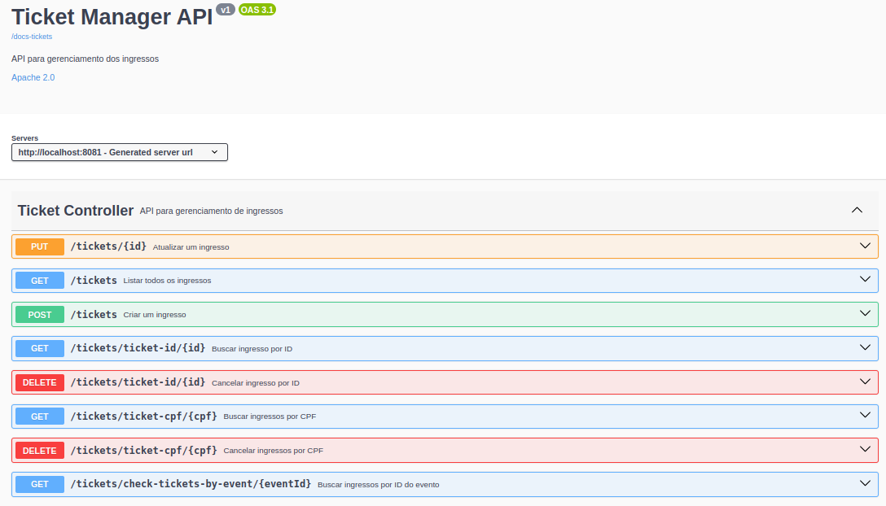
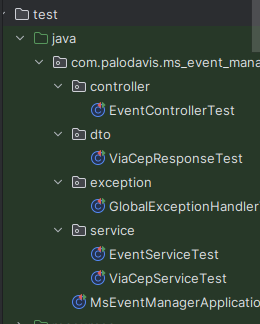
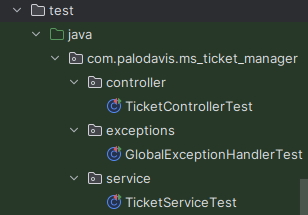
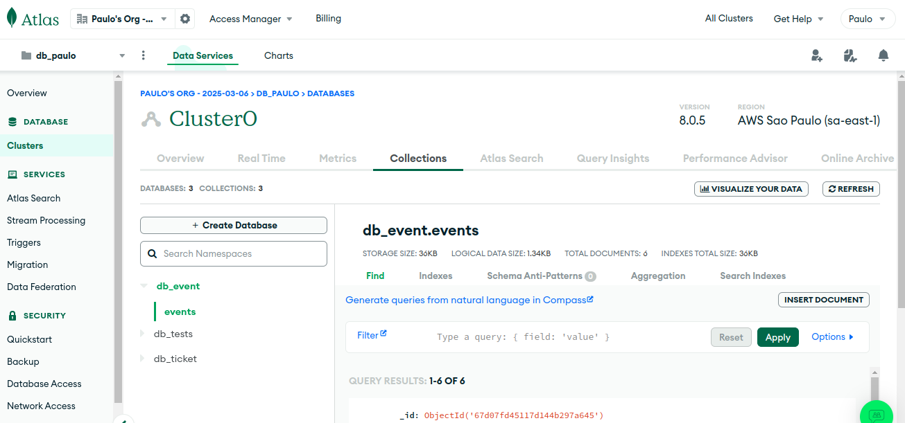
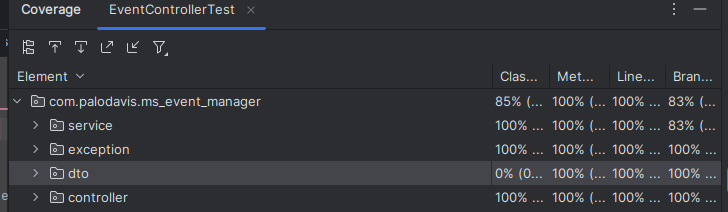

# Event and Ticket Management System

Este projeto é um sistema de gerenciamento de eventos e ingressos, desenvolvido em **Java 17**, com deploy na **AWS** e utilizando o **MongoDB Atlas** como banco de dados. O sistema é composto por dois microsserviços principais: `ms-event-manager` (gerenciamento de eventos) e `ms-ticket-manager` (gerenciamento de ingressos).

---

## Tecnologias Utilizadas

- **Linguagem**: Java 17
- **Banco de Dados**: MongoDB Atlas
- **Cloud**: AWS (Amazon Web Services)
- **Frameworks**: Spring Boot, Spring Web, Spring Data MongoDB
- **Ferramentas**: Maven, Docker, Swagger.

---

## Arquitetura do Projeto

Este projeto segue a arquitetura de **microserviços** e é parte de um **sistema distribuído**, onde diferentes componentes do sistema são responsáveis por funcionalidades específicas, comunicando-se entre si para garantir a execução eficiente das tarefas.

- **Microserviço A (Event):** Responsável pelo gerenciamento de eventos, rodando na porta 8080.
- **Microserviço Bm (Ticket):** Responsável pela criação e consulta de ingressos, rodando na porta 8081.
- **Comunicação entre Microserviços:** Ambos os microserviços se comunicam de forma **sincronizada**, com dependência mútua para a operação completa do sistema.
- **Banco de Dados:**
   - O microserviço **Event** utiliza o banco de dados `db_event` no MongoDB Atlas.
   - O microserviço **Ticket** utiliza o banco de dados `db_ticket` também no MongoDB Atlas.
- **Docker:** Utilizado para a **containerização** dos microserviços, facilitando o gerenciamento e a execução de ambos os serviços em ambientes isolados.
- **Deploy na AWS:** Os microserviços são implantados na nuvem utilizando **EC2**, garantindo escalabilidade, alta disponibilidade e robustez, essenciais para SD.

---
# Execução do Projeto

## Pré-requisitos

Certifique-se de ter os seguintes requisitos antes de executar o projeto:

- **Git** instalado para clonar o repositório.
- **IDE** (preferencialmente **IntelliJ IDEA**).
- **Maven** configurado para gerenciar as dependências.
- **Docker** e **Docker Compose** instalados na máquina.
- MongoDB atlas configurado em nuvem.
- Permissões adequadas para rodar os comandos na pasta raiz do projeto.

## Como executar localmente

1. **Clonar o repositório:**
   ```bash
   git clone https://github.com/palodavis/Challenge3-compass-microservices.git
   ```
2. **Abrir o projeto na IDE** (IntelliJ IDEA recomendado).
3. **Rodar as dependências do Maven**.
4. **Executar o Docker Compose na pasta raiz:**
   ```bash
   docker-compose up --build
   ```
---
## Endpoints disponíveis

- Os endpoints podem ser acessados localmente apenas pelas portas **8080** e **8081**.
- Obs: No deploy na AWS, a URL será diferente e deve ser configurada com o **IP público** da instância EC2.

---
## Microsserviços


#### **Microsserviço: `ms-event-manager`**

Responsável pelo gerenciamento de eventos (CRUD), permitindo a criação, consulta, atualização e cancelamento de eventos.

| Método | Endpoint                                | Descrição                                                                 |
|--------|-----------------------------------------|---------------------------------------------------------------------------|
| POST   | `http://<localhost ou IP>:8080/events`  | Cria um novo evento.                                                     |
| GET    | `http://<localhost ou IP>:8080/events`  | Lista todos os eventos cadastrados.                                      |
| GET    | `http://<localhost ou IP>:8080/events/{id}` | Busca um evento pelo ID.                                                 |
| GET    | `http://<localhost ou IP>:8080/events/sorted` | Lista eventos ordenados pelo nome.                                       |
| PUT    | `http://<localhost ou IP>:8080/events/{id}` | Atualiza os dados de um evento existente.                                |
| DELETE | `http://<localhost ou IP>:8080/events/delete-event/{id}` | Exclui um evento pelo ID (se não houver ingressos vendidos).             |

### **Microsserviço: `ms-ticket-manager`**

Responsável pelo gerenciamento de ingressos (CRUD), permitindo a criação, consulta, atualização e cancelamento de ingressos.

| Método | Endpoint                                                                 | Descrição                                                                 |
|--------|--------------------------------------------------------------------------|---------------------------------------------------------------------------|
| POST   | `http://<localhost ou IP>:8081/tickets`                                  | Cria um novo ingresso.                                                   |
|        |                                                                          | **Validação**: Verifica a existência do evento no microsserviço `ms-event-manager` antes de criar o ingresso. |
| GET    | `http://<localhost ou IP>:8081/tickets/ticket-id{id}`                    | Consulta um ingresso pelo ID.                                            |
| GET    | `http://<localhost ou IP>:8081/tickets/ticket-cpf/{cpf}`                 | Consulta ingressos associados a um CPF.                                  |
| PUT    | `http://<localhost ou IP>:8081/tickets/{id}`                             | Atualiza um ingresso pelo ID.                                            |
| DELETE | `http://<localhost ou IP>:8081/tickets/cancel-ticket/{id}`               | Cancela um ingresso pelo ID (soft-delete).                               |
| DELETE | `http://<localhost ou IP>:8081/tickets/cancel-ticket/{cpf}`              | Cancela ingressos associados a um CPF (soft-delete).                     |
| GET    | `http://<localhost ou IP>:8081/tickets/check-tickets-by-event/{eventId}` | Verifica se existem ingressos vinculados a um evento específico.       |

---

# Requisições de API para Tickets e Events no Postman ou Insomnia

- Requisitos necessários para fazer as requisições:

1. **Abrir o Postman ou Insomnia**
2. **Selecionar o Método HTTP correto** (`GET`, `POST`, `DELETE` ou `PUT`)
3. **Inserir a URL correspondente** ao endpoint desejado
4. **Para requisições `POST` e `PUT`:**
    - Ir para a aba `Body`
    - Selecionar `raw` e o formato `JSON`
    - Inserir o corpo da requisição conforme os exemplos
5. **Para requisições `GET` e `DELETE`:**
    - Apenas inserir a URL e executar
6. **Clicar em "Send"** para enviar a requisição e verificar a resposta

**Observação:** Certifique-se de que a API está rodando no `localhost:8081` ou `localhost:8080` antes de realizar as requisições.

## Endpoints de Tickets

### Buscar Todos os Tickets
**Método:** `GET`  
**URL:** ```http://localhost:8081/tickets```

### Buscar Ticket por ID
**Método:** `GET`  
**URL:** ```http://localhost:8081/tickets/ticket-id/a0a0155d-3e6a-4430-abaa-9c3152de0e26```

### Buscar Ticket por CPF
**Método:** `GET`  
**URL:** ```http://localhost:8081/tickets/ticket-cpf/123.456.789-00```

### Criar um Ticket
**Método:** `POST`  
**URL:** ```http://localhost:8081/tickets```

#### Corpo da Requisição (JSON):
```json
{
    "cpf": "123.456.789-12",
    "customerName": "Teste nome",
    "customerMail": "testeemail@email.com",
    "event": {
        "eventId": "67d302db048d39582e9c6043"
    },
    "brltotalAmount": "R$ 60,00",
    "usdtotalAmount": "R$ 12,00"
}
```

### Deletar ticket por ID
**Método:** `DELETE`  
**URL:** ```http://localhost:8081/tickets/ticket-id/8aefb058-e950-4df3-8eec-9eac66114ef7```

### Deletar ticket por CPF
**Método:** `DELETE`  
**URL:** ```http://localhost:8081/tickets/ticket-cpf/123.456.789-12```

### Atualizar um Ticket por ID
**Método:** `PUT`  
**URL:** ```http://localhost:8081/tickets/f252239d-4d54-46be-a995-2f18e54fd155```

#### Corpo da Requisição (JSON):
```json
{
    "customerName": "Paulo dias",
    "customerMail": "paulo.dias@email.com",
    "event": {
        "eventId": "67d07fd45117d144b297a645"
    },
    "brltotalAmount": "R$ 200",
    "usdtotalAmount": "R$ 40"
}
```

### Checar Ingressos Vinculados ao Evento
**Método:** `GET`  
**URL:** ```http://localhost:8081/tickets/check-tickets-by-event/67d07fd45117d144b297a645```

## Endpoints de Eventos

### Buscar Todos os Eventos
**Método:** `GET`  
**URL:** ```http://localhost:8080/events```

### Buscar Evento por ID
**Método:** `GET`  
**URL:** ```http://localhost:8080/events/67d07fd45117d144b297a645```

### Buscar Eventos Ordenados
**Método:** `GET`  
**URL:** ```http://localhost:8080/events/sorted```

###  Criar um Evento
**Método:** `POST`  
**URL:** ```http://localhost:8080/events```

#### Corpo da Requisição (JSON):
```json
{
  "eventName": "curso de java",
  "dateTime": "2024-10-15T20:30:30",
  "cep": "123456-000"
}
```

### Atualizar um Evento por ID
**Método:** `PUT`  
**URL:** ```http://localhost:8080/events/67d07fd45117d144b297a645```

#### Corpo da Requisição (JSON):
```json
{
  "eventName": "Futebol de salão",
  "dateTime": "2023-10-15T20:00:00",
  "cep": "123456-000"
}
```

### Deletar um Evento
**Método:** `DELETE`  
**URL:** ```http://localhost:8080/events/delete-event/67d07fd45117d144b297a645```

---
# Documentação da API - Swagger
Utilizado a documentação da API utilizando **Swagger**, proporcionando uma interface interativa para explorar os endpoints disponíveis. 
O Swagger facilita a exploração e teste da API diretamente pelo navegador.

### Acessando a Documentação de ambos microsserviços:
#### Microserviço de Events
**Localmente:**  
[http://localhost:8080/docs-events.html](http://localhost:8080/docs-events.html)

**No Deploy AWS:**  
Se estiver rodando na AWS, substitua `localhost` pelo **IP público** da sua instância EC2.

*Exemplo da documentação:*  


---

#### Microserviço de Tickets
**Localmente:**  
[http://localhost:8081/docs-tickets.html](http://localhost:8080/docs-tickets.html)

**No Deploy AWS:**  
Se estiver rodando na AWS, substitua `localhost` pelo **IP público** da sua instância EC2.

*Exemplo da documentação:*  


---

## Testes Automatizados

Os testes foram implementados utilizando **JUnit** e **Mockito** para garantir a confiabilidade e estabilidade do sistema.  
Todos os testes estão organizados na pasta `tests` de cada microsserviço.

### Estrutura dos Testes

Abaixo, estão as localizações dos testes em cada microsserviço:

<div align="center">
  <table>
    <tr>
      <th>Testes do Event Manager</th>
      <th>Testes do Ticket Manager</th>
    </tr>
    <tr>
      <td align="center">
        
      </td>
      <td align="center">
        
      </td>
    </tr>
  </table>
</div>


### Cobertura de Testes

Para visualizar a cobertura de testes no **IntelliJ IDEA**, siga os passos abaixo:

1. Abra a classe de teste desejada.
2. Execute-a utilizando a opção **Run with Coverage**.

Isso gerará um relatório visual da cobertura de código, conforme ilustrado nas imagens abaixo:

### Cobertura de Testes nos Microsserviços de Tickets


### Cobertura de Testes nos Microsserviços de Events


- Ambos os microsserviços atingiram uma cobertura superior a **80%**, conforme recomendado para o projeto.

---
## Deploy na AWS com EC2

### Requisitos

Para configurar e implantar os microsserviços na AWS, deve possuir os seguintes requisitos:

1. **Conta na AWS** – Certifique-se de ter uma conta na AWS.
2. **Criar uma VPC** – Configurar uma Virtual Private Cloud (VPC) para hospedar os serviços.
3. **Criar um Security Group** – Definir um grupo de segurança permitindo tráfego nas portas **8080** e **8081**.
4. **Criar um Key Pair** – Gerar um par de chaves para acessar a instância via SSH.
5. **Criar uma Instância EC2** – Configurar uma instância associando-a à **VPC**, ao **Security Group** e ao **Key Pair** criados anteriormente. Selecionar a Amazon Machine Image (AMI) do Amazon Linux para iniciar a máquina. 
- **Importante:** Certifique-se de que sua instância EC2 e todos os recursos foram configurados na região correta, no meu caso utilizei a **us-east-2**. Caso contrário, os serviços podem não funcionar corretamente.

- Caso tenha funcionado a criação da instância, aparecerá na tela como desta forma:

### Conectando-se à EC2

1. Conectar-se à instância via SSH:
   ```bash
   ssh ec2-user@<IP_PUBLICO>
   


   
2. **Instalar o Docker na EC2:**
   
   ```bash
   sudo yum update -y
   sudo yum install docker -y
   sudo service docker start
   sudo usermod -a -G docker ec2-user
   ```

3. **Instalar o Docker Compose na EC2:**
   ```bash
   sudo curl -L "https://github.com/docker/compose/releases/download/v2.14.2/docker-compose-$(uname -s)-$(uname -m)" -o /usr/local/bin/docker-compose
   sudo chmod +x /usr/local/bin/docker-compose
   ```

4. **Enviar a pasta do projeto para a EC2:**
   ```bash
   scp -r ~/Challenge3-compass-microservices ec2-user@<IP_PUBLICO>:/home/ec2-user
   ```

5. **Acessar a pasta do projeto na EC2:**
   ```bash
   cd /home/ec2-user/Challenge3-compass-microservices
   ```

6. **Executar o Docker Compose na EC2:**
   ```bash
   sudo docker-compose up --build
   ```

- Esse comando iniciará os contêineres Docker dos microsserviços de eventos e ingressos, garantindo que todas as dependências sejam construídas corretamente.


- Caso tenha chegado até nessa parte, pode ser realizados os testes normalmente.
- Para testar os endpoints, basta substituir  `localhost` pelo **IP público**